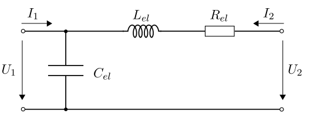
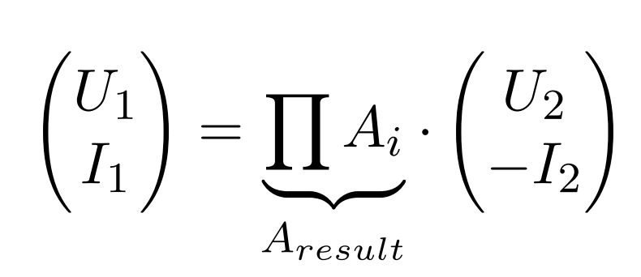

# cardioLPN

In this repository, I would like provide some useful tools to construct ordinary differential equations (ODE) that can be used for describing the cardiovascular system. Due to the [electronic–hydraulic analogy](https://en.wikipedia.org/wiki/Hydraulic_analogy), the cardiovascular system can be represented by an electronic circuit as a so called lumped parameter network (LPN). Focus of this repository is the construction and analysis of LPN.

So far, only linear elements are provided.

## Motivation

Let us say, you want to model a vessel:

Pressure and volume flow for inflow and outflow are indicated as P and Q in the figure. The vessel is elastic, meaning that it can change its overall volume.
This phenomenon is also defined as [windkessel effect](https://en.wikipedia.org/wiki/Windkessel_effect) and can be modeled by using the following circuit (see chapter "analogy" for more details):

In other words, we used a combination of a conductor, coil and resistor.

Now, how to define the ODE for this circuit? How to get the relation between input and output?

In matrix form the task could look like:
<p align="center">

</p>

where the task now is to find the matrix A_result.

For doing so, we can use the two-port network theory to a set of standard [elements](figs/LPN_elements.png). We receive A_result by multiplying the matrices of all used elements in the right order:

$$A_{result} = A_C \cdot A_L \cdot A_R $$

In python, this would look like the following:
```python
# loading cardioLPN from this repository
from cardioLPN import A_R, A_L, A_C
from sympy import symbols

# Defining the parameters R, L and C
R, L, C = symbols('R L C', positive=True)

# Computing A_result; The matrics A_C, A_L and A_R are implemented in cardioLPN
A_result = A_C(C)*A_L(L)*A_R(R)
```
Result for A_result:
```python
>>> A_result
Matrix([
[  1,              L*s + R],
[C*s, C*L*s**2 + C*R*s + 1]])
```
A_result contains the relation between U_1, U_2, I_1 and I_2.

---
Let us assume that $U_1 = U_2$ and $I_1 = I_2$. Then, the ODE in s-domain is computed by
```python
# Defining signals U and I
U, I = symbols('U I', positive=True)
ODE = A_result * x - x
```
The result for the ODE is
```python
>>> ODE
Matrix([
[                        -I*(L*s + R)],
[C*U*s - I*(C*L*s**2 + C*R*s + 1) + I]])
```
The first equation is
$$ -I(s) \cdot (L \cdot s + R) = 0$$

The second equation (after simplification):
$$ U(s) - I(s)\cdot (L\cdot s + R) = 0$$


---
coming later...

Solving the ODE
```python
# defining a function for U_2 and I_2
U_2 = 1/(s*(1+s*5))
I_2 = 1/(s*(1+s*15))

# defining
x_2 = Matrix([U_2, I_2])

x_1 = A_result * x_2

#
U_1 = x_1[0]
I_1 = x_1[1]

u_1 = inverse_laplace_transform(x_1[0], s, t)
```
---
## Example
Coming soon.

Example 1
(0D/3D coupling)
## Usage

## Analogy

## References
[E. Kung, G. Pennati, F. Migliavacca, T.-Y. Hsia, R. Figliola, A. Marsden, and A. Giardini, “A Simulation Protocol for Exercise Physiology in Fontan Patients Using a Closed Loop Lumped-Parameter Model,” J. Biomech. Eng., vol. 136, no. 8, p. 81007, 2014.](http://biomechanical.asmedigitalcollection.asme.org/article.aspx?articleid=1852723)
